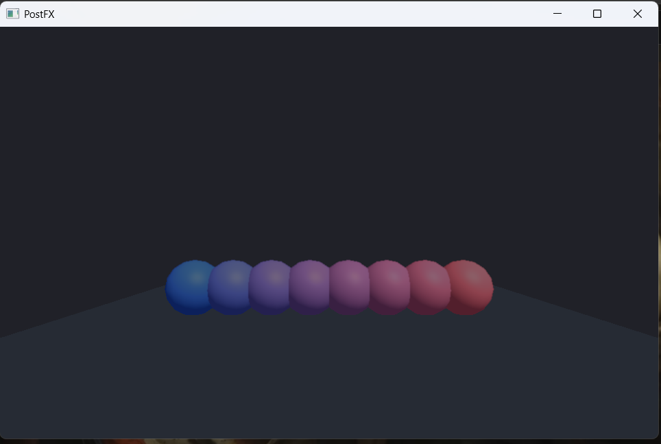

# Post-processing

OpenGL **3.3** fullscreen blit. After the G3N scene (and water FBO / shadows), the color buffer is sampled once.



| Pass | What it is | What it is not |
| --- | --- | --- |
| Tonemap | After exposure: `reinhard` (default, `c/(c+1)`), `neutral` (Khronos PBR Neutral), `aces` (fitted), `none` (clamp) | A separate filmic LUT texture |
| Bloom | Half-resolution chain (bright extract, then four smaller passes) added before tonemap. The 9-tap extract remains if the chain cannot be built | Separate compute bloom |
| FXAA | Neighbor luma blend | SMAA / TAA |
| Grade | Contrast, saturation, RGB tint | Lift/gamma/gain wheels |

ImGui draws **after** the blit so editor panels stay unprocessed.

Commands: `EnablePostFX`, `SetExposure`, `SetTonemap`, `SetBloom`, `SetFXAA`, `SetColorGrade`. Outdoor and indoor lighting presets store an exposure and the neutral tonemap; they do not enable this stack. See `docs/LIGHTING.md` and `docs/COMMANDS.md`.

```powershell
.\bs.exe examples\postfx.bb
```

Arrow keys adjust exposure (up/down) and bloom (left/right). Close the window to quit.
